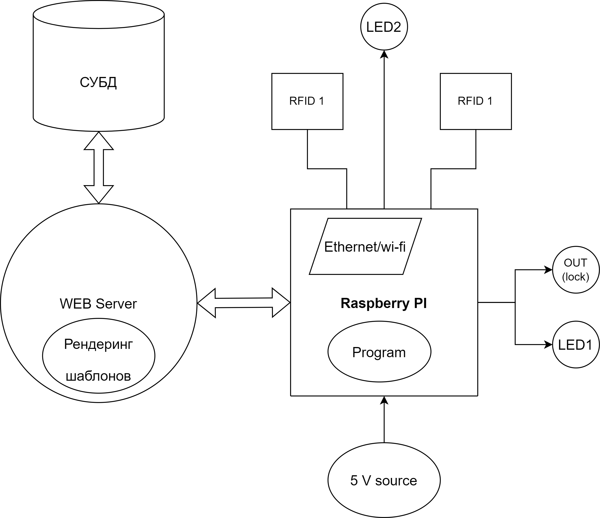
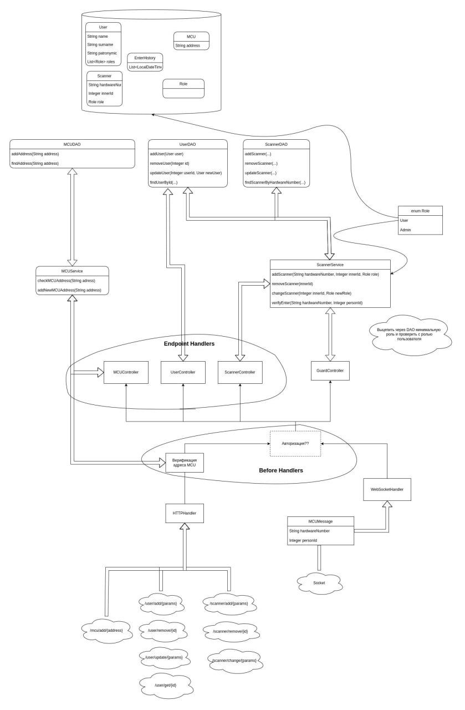
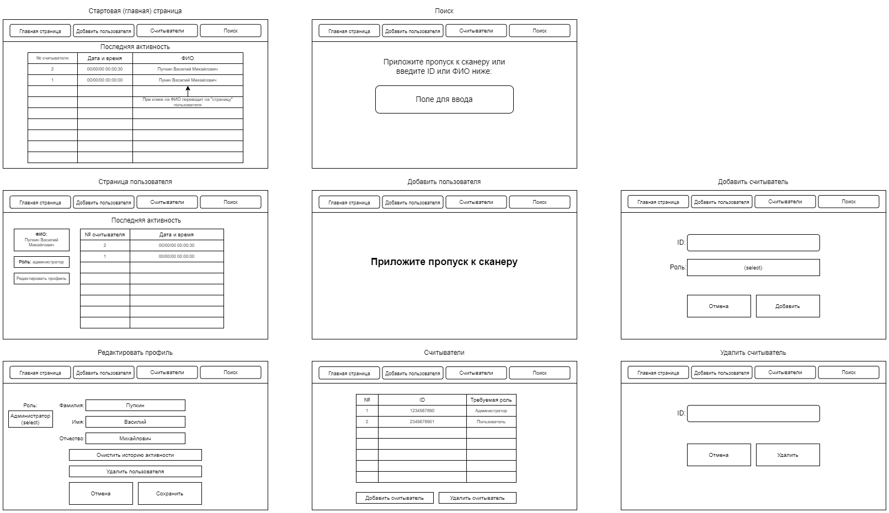

# Архитектурная схема, описание частей и взаимодействия

## Систему можно разделить на серверную и встраиваемую части.

### Серверная часть состоит из:
- Базы данных со всей информацией о людях и их правах на доступ в помещения, сроке их действия 
- Веб-приложения, реализующего логику авторизации, редактирование данных о пользователях и управляющего встраиваемой частью 
- Веб-интерфейса для администрирования системы и получения статистики использования 
- Веб-интерфейс генерируется шаблонизатором на сервере. Доступ к СУБД осуществляется с помощью ORM провайдера. СУБД может быть развернута как на той же машине, что веб приложение, так и на удаленном хосте.

#### Схема back-end части:

#### Схема front-end части:

### Встраиваемая часть состоит из:
- Источника питания с **напряжением 5 В** 
- Компьютера Raspberry PI со встроенными **модулями Ethernet или Wi-Fi** 
- Двух RFID модулей **Troyka**
- Двух индикаторных светодиодов 
- Интерфейса для подключения **запирающего устройства**

## Используемые технологии 
- **Raspberry PI** работает под управлением Linux 
- Приложение на Raspberry PI будет написано **на C++** 
- Питание Raspberry Pi 3 будет осуществляться от источника, который будет иметь **силу тока 2А и напряжение 5В** 
- Встраиваемая часть взаимодействует с серверной частью **по протоколу TCP** 
- Используются RFID модули **по шине I2C** 
- **Светодиоды и выход** под Troyka 
- RFID модули, подключающие замок, управляются **портами GPIO** 
- Для хранения данных используется **СУБД Postgres**

### Фреймворки
- **Front-end** часть веб-приложения будет написана на **ReactJS**
- **Back-end** часть на **Javalin**
- Чтобы раздавать реактивную статику используем **фреймворк Hilla**
- Для **связи веб-приложения с БД** будет использоваться **ORM Hibernate**
